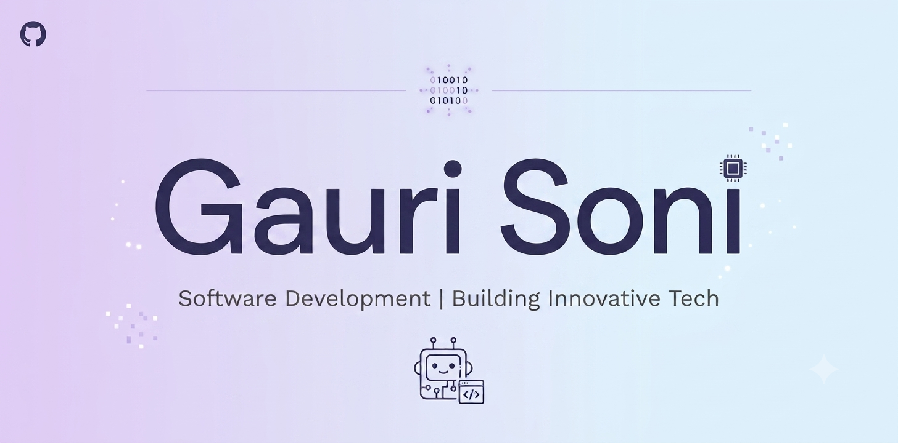

  

<h1 align="center">Hi there, I'm Gauri 👋</h1>

Final-year Computer Science student passionate about <b>Software Development</b>, <b>Machine Learning</b>, and building real-world applications.
  
Currently preparing for <b>Software Development Engineer (SDE)</b> roles while building projects in AI, Computer Vision, Full-Stack Development, and Generative AI.

## 🌱 Currently

- 🛰 Working on **AI-Based UAV Intrusion Detection** as part of my DRDO internship.
- 💻 Preparing for **Software Development Engineer (SDE)** roles through consistent DSA practice and core CS revision.
- 📚 Exploring **System Design** and writing cleaner, more scalable software.
- 🚀 Continuously improving my development skills by building end-to-end projects.

---

<!--
**gaurisoni2027/gaurisoni2027** is a ✨ _special_ ✨ repository because its `README.md` (this file) appears on your GitHub profile.

Here are some ideas to get you started:

- 🔭 I’m currently working on ...
- 🌱 I’m currently learning ...
- 👯 I’m looking to collaborate on ...
- 🤔 I’m looking for help with ...
- 💬 Ask me about ...
- 📫 How to reach me: ...
- 😄 Pronouns: ...
- ⚡ Fun fact: ...
-->
